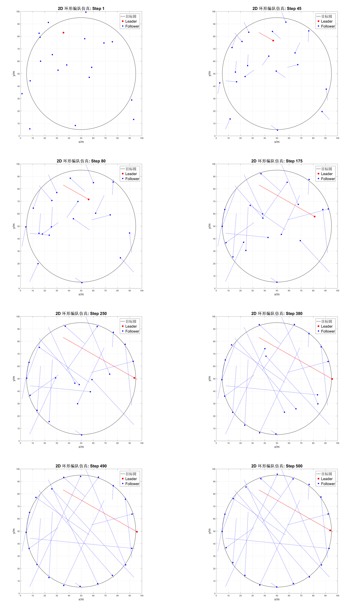
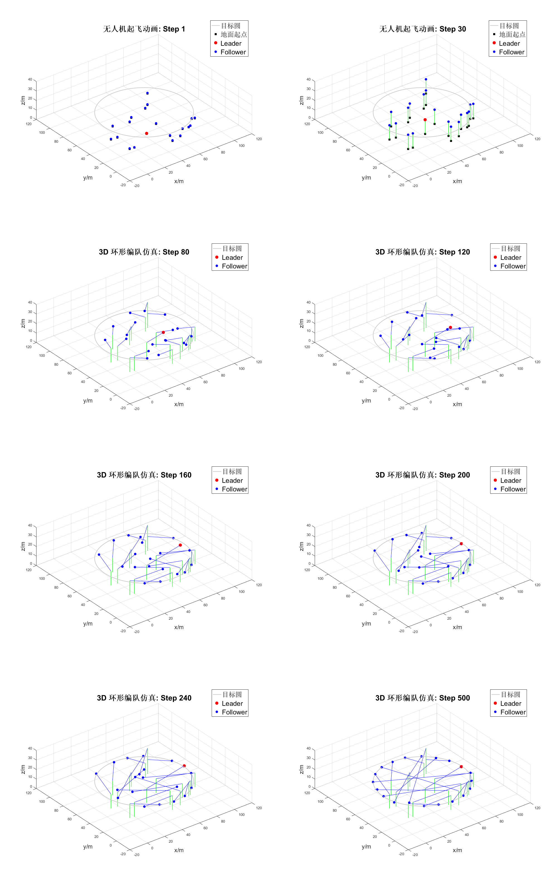

[🇨🇳 中文文档](#chinese) | [🇺🇸 English](#english)

# 无人机编队控制模型

  

其他编队项目（友链）：
- [Flocking-Formation-Control](https://github.com/Ronchy2000/Flocking-Formation-Control)：群集/编队控制相关实现
- [Formation_Control_quadrangular](https://github.com/Ronchy2000/Formation_Control_quadrangular)：四边形编队控制实现

本仓库包含了基于环形拓扑的无人机编队控制算法实现，分为2D平面编队和3D空间编队两种模式。

我还有其他编队相关代码仓库，欢迎查看：
- [Flocking-Formation-Control](https://github.com/Ronchy2000/Flocking-Formation-Control)：群体/编队协同控制的实现与实验
- [Formation_Control_quadrangular](https://github.com/Ronchy2000/Formation_Control_quadrangular)：四边形编队控制实现

## 项目结构

本项目包含原始版本和更新版本的编队控制算法实现：

- 原始版本：`ring_formation_control_main_2D.m`和`ring_formation_control_3D.m`
- 更新版本：`ring_formation_control_main_2D_update.m`和`ring_formation_control_3D_update.m`

### 版本区别

- **2D编队控制**：
  - 原始版本：基础的环形拓扑2D编队控制实现
  - 更新版本：优化了控制参数，提高了编队稳定性和收敛速度，增强了对外部干扰的抵抗能力

- **3D编队控制**：
  - 原始版本：基础的3D空间编队控制实现
  - 更新版本：改进了高度协同算法，增强了碰撞避免功能，优化了姿态控制精度

## 2D平面编队控制

### 方法介绍

2D平面编队控制基于环形拓扑结构，通过分布式控制算法实现多无人机在平面内的编队飞行。主要特点：

1. **环形拓扑结构**：每个无人机只与相邻的两个无人机通信，形成环形通信网络
2. **分布式控制**：无需中央控制器，每个无人机基于局部信息做出决策
3. **一致性算法**：通过一致性理论保证所有无人机最终达到期望的编队形状
4. **自适应控制**：能够适应外部干扰和初始位置的不确定性

### 演示效果

## 3D空间编队控制

### 方法介绍

3D空间编队控制在2D编队的基础上，扩展到三维空间，实现更复杂的立体编队飞行。主要特点：

1. **三维空间控制**：实现无人机在三维空间的编队控制
2. **高度协同**：在保持平面编队的同时，协调控制高度变化
3. **姿态控制**：考虑无人机的姿态动力学，实现更精确的空间编队
4. **鲁棒性设计**：对外部扰动和参数不确定性具有较强的鲁棒性
5. **碰撞避免**：包含碰撞避免算法，确保编队过程中无人机之间不发生碰撞

### 演示效果

## 算法实现

本项目中的编队控制算法主要基于以下理论：

- 图论和拓扑控制
- 一致性理论
- 非线性控制
- 分布式优化

算法在MATLAB环境中实现，通过仿真验证了算法的有效性和稳定性。

## 使用说明

1. 运行2D编队控制：
   - 基础版本：执行`ring_formation_control_main_2D.m`
   - 优化版本：执行`ring_formation_control_main_2D_update.m`（推荐）
2. 运行3D编队控制：
   - 基础版本：执行`ring_formation_control_3D.m`
   - 优化版本：执行`ring_formation_control_3D_update.m`（推荐）
3. 仿真结果将保存在对应的frames文件夹中

## 图像处理工具

仓库中包含了用于处理仿真生成图像的Python脚本：

- `uav_ring_formation2D_update/frames_1/合并.py`：用于处理和合并2D编队仿真图像
- `uav_ring_formation3D_update/frames_2/新建文本文档.py`：用于处理和合并3D编队仿真图像
这些工具可以帮助生成编队过程的可视化展示。

---
[🇨🇳 中文文档](#chinese) | [🇺🇸 English](#english)

# UAV Formation Control Model
  

Other formation projects (friend links):
- [Flocking-Formation-Control](https://github.com/Ronchy2000/Flocking-Formation-Control): Flocking/formation control implementations
- [Formation_Control_quadrangular](https://github.com/Ronchy2000/Formation_Control_quadrangular): Quadrangular formation control implementation

This repository contains implementations of UAV formation control algorithms based on ring topology, divided into 2D planar formation and 3D spatial formation modes.

I also maintain other formation-related repos:
- [Flocking-Formation-Control](https://github.com/Ronchy2000/Flocking-Formation-Control): Flocking and formation coordination implementations and experiments
- [Formation_Control_quadrangular](https://github.com/Ronchy2000/Formation_Control_quadrangular): Quadrangular formation control implementation

## Project Structure

This project includes both original and updated versions of formation control algorithm implementations:

- Original versions: `ring_formation_control_main_2D.m` and `ring_formation_control_3D.m`
- Updated versions: `ring_formation_control_main_2D_update.m` and `ring_formation_control_3D_update.m`

### Version Differences

- **2D Formation Control**:
  - Original version: Basic implementation of ring topology 2D formation control
  - Updated version: Optimized control parameters, improved formation stability and convergence speed, enhanced resistance to external disturbances

- **3D Formation Control**:
  - Original version: Basic implementation of 3D spatial formation control
  - Updated version: Improved height coordination algorithm, enhanced collision avoidance functionality, optimized attitude control precision

## 2D Planar Formation Control

### Method Introduction

2D planar formation control is based on ring topology structure, implementing multi-UAV formation flight in a plane through distributed control algorithms. Main features:

1. **Ring Topology Structure**: Each UAV only communicates with two adjacent UAVs, forming a ring communication network
2. **Distributed Control**: No central controller needed, each UAV makes decisions based on local information
3. **Consensus Algorithm**: Ensures all UAVs eventually achieve the desired formation shape through consensus theory
4. **Adaptive Control**: Able to adapt to external disturbances and initial position uncertainties

### Demonstration Effect

## 3D Spatial Formation Control

### Method Introduction

3D spatial formation control extends 2D formation to three-dimensional space, implementing more complex spatial formation flight. Main features:

1. **Three-dimensional Space Control**: Implements UAV formation control in three-dimensional space
2. **Height Coordination**: Coordinates height changes while maintaining planar formation
3. **Attitude Control**: Considers UAV attitude dynamics for more precise spatial formation
4. **Robust Design**: Strong robustness to external disturbances and parameter uncertainties
5. **Collision Avoidance**: Includes collision avoidance algorithms to ensure no collisions between UAVs during formation

### Demonstration Effect

## Algorithm Implementation

The formation control algorithms in this project are mainly based on the following theories:

- Graph theory and topology control
- Consensus theory
- Nonlinear control
- Distributed optimization

The algorithms are implemented in MATLAB environment, and their effectiveness and stability have been verified through simulation.

## Usage Instructions

1. Run 2D formation control:
   - Basic version: Execute `ring_formation_control_main_2D.m`
   - Optimized version: Execute `ring_formation_control_main_2D_update.m` (recommended)
2. Run 3D formation control:
   - Basic version: Execute `ring_formation_control_3D.m`
   - Optimized version: Execute `ring_formation_control_3D_update.m` (recommended)
3. Simulation results will be saved in the corresponding frames folder

## Image Processing Tools

The repository contains Python scripts for processing simulation-generated images:

- `uav_ring_formation2D_update/frames_1/合并.py`: For processing and merging 2D formation simulation images
- `uav_ring_formation3D_update/frames_2/新建文本文档.py`: For processing and merging 3D formation simulation images

These tools help generate visual presentations of the formation process.
